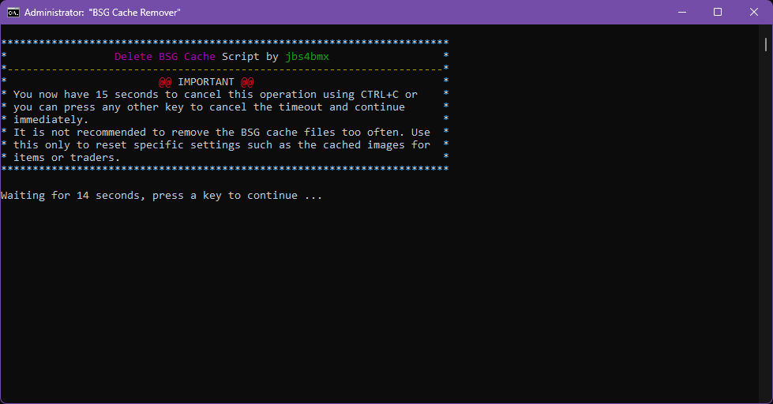
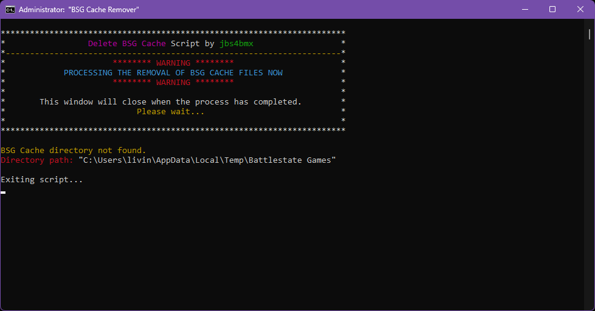
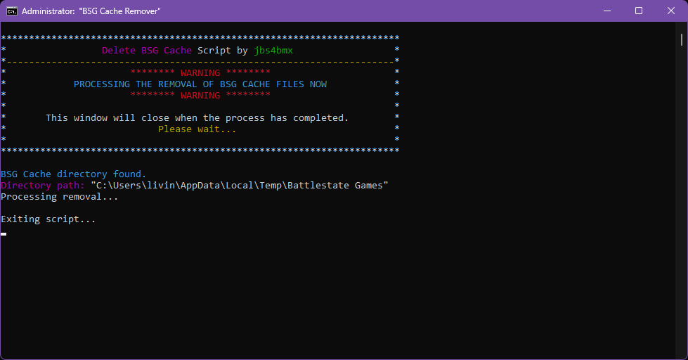

# DeleteBSGCache
A script to delete the game cache for EfT

A simple Windows Batch script to delete the BSG cache folder in a User's Local AppData folder. Recommended to run prior to loading mods in SPT-AKI that may edit pre-cached elements of the game.

Admin Privileges are not required to run this script.

You'll be greeted with this screen upon running the script:

And then this screen if you continue and the cache is not present:

Or this screen if you continue and the cache is present and removal processes:

The script will remove the "**Battlestate Games**" folder located at _**C:\\Users\\{USERNAME}\\AppData\\Local\\Temp\\Battlestate Games**_
