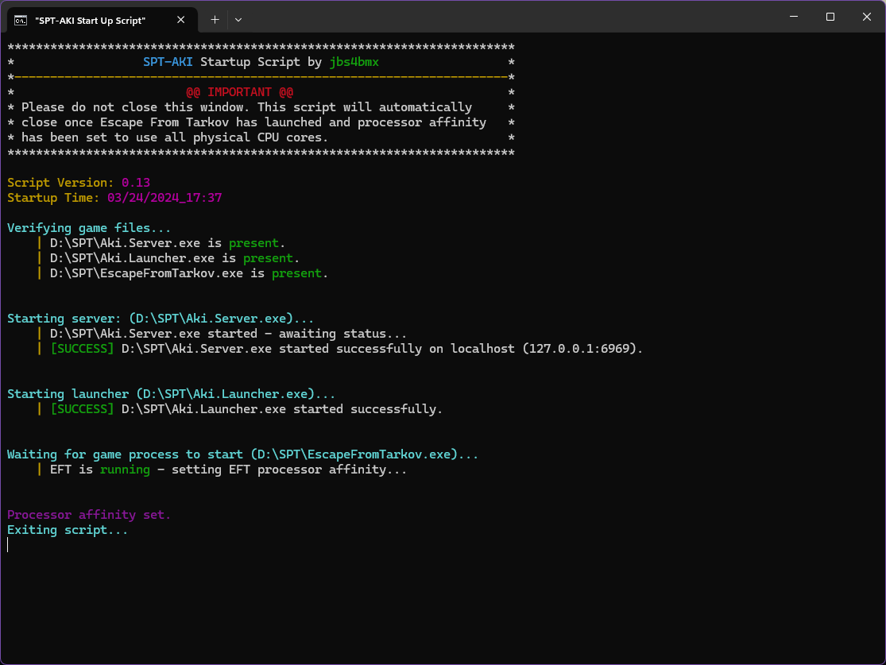

# SPT-AKI STARTUP SCRIPTS - BATCH

> Author: jbs4bmx

### WHAT ARE THESE
These are startup scripts to aid in the launching of SPT's server and launcher. The scripts will detect the presence of the server and launcher exe files and if present start them in order. They start with server first, pause temoprarily to allow the server to complete it's startup, and then they start the launcher. After starting the launcher, the script will wait for the Escape from Tarkov process to be detected and will then set CPU affinity to help enhance the performance of EFT.

CPU affinity can be edited within the script and I have included values for everything from 2-core to 16-core CPUs.
If you need to calculate your own values, I highly recommend this [Processor Affinity Calculator](https://www.gfsg.co.uk/affinitymask.aspx?SubMenuItem=utilties).

### PRODUCT DETAILS
There are two scripts.
Both scripts include values in their comments for configurations of processor affinity for 2-core to 16-core CPUs.

> Start_SPT-AKI.bat
   - For Hyper-Threaded CPUs
   - Determines whether the game runs on physical cores or logical cores by starting at either Core 0 (physical) or Core 1 (logical).

> Start_SPT-AKI_noHT.bat
   - For non-Hyper-Threaded CPUs or CPUs where Hyper-Threading has been disabled.
   - Enables every other "core" starting with either Core 0 or Core 1.

> Note: Affinity feature is currently not in place for Intel's PE core CPUs. ETA:Unknown

### INSTRUCTIONS:
Place either of the scripts into the root of your SPT folder.
Right-click on the script and select the option to create a shortcut.
Pin the shortcut to your taskbar, Start Menu, or move it to your desktop for easy access.

### CPU AFFINITY CHARTS
** Non-Hyper-Threaded CPUs or CPUs with HT Disabled **
| CORES   | AFFINITY       | CPU CORES                                              | CORE TYPE            |
|---------|---------------:|--------------------------------------------------------|----------------------|
| 2-CORE  | 1 2         | (0) (1)                                             | Physical Physical |
| 4-CORE  | 5 10        | (0,2) (1,3)                                         | Physical Physical |
| 6-CORE  | 21 42       | (0,2,4) (1,3,5)                                     | Physical Physical |
| 8-CORE  | 85 170      | (0,2,4,6) (1,3,5,7)                                 | Physical Physical |
| 10-CORE | 341 682     | (0,2,4,6,8) (1,3,5,7,9)                             | Physical Physical |
| 12-CORE | 1365 2730   | (0,2,4,6,8,10) (1,3,5,7,9,11)                       | Physical Physical |
| 14-CORE | 5461 10922  | (0,2,4,6,8,10,12) (1,3,5,7,9,11,13)                 | Physical Physical |
| 16-CORE | 21845 43690 | (0,2,4,6,8,10,12,14) (1,3,5,7,9,11,13,15)           | Physical Physical |
 

** Hyper-Threaded CPUs **
| CORES   | AFFINITY                 | CPU CORES                                                                                    | CORE TYPE           |
|---------|-------------------------:|----------------------------------------------------------------------------------------------|---------------------|
| 2-CORE  | 5 10                  | (0,2) (1,3)                                                                               | Physical Virtual |
| 4-CORE  | 85 170                | (0,2,4,6) (1,3,5,7)                                                                       | Physical Virtual |
| 6-CORE  | 1365 2730             | (0,2,4,6,8,10) (1,3,5,7,9,11)                                                             | Physical Virtual |
| 8-CORE  | 21845 43690           | (0,2,4,6,8,10,12,14) (1,3,5,7,9,11,13,15)                                                 | Physical Virtual |
| 10-CORE | 349525 699050         | (0,2,4,6,8,10,12,14,16,18) (1,3,5,7,9,11,13,15,17,19)                                     | Physical Virtual |
| 12-CORE | 5592405 11184810      | (0,2,4,6,8,10,12,14,16,18,20,22) (1,3,5,7,9,11,13,15,17,19,21,23)                         | Physical Virtual |
| 14-CORE | 89478485 178956970    | (0,2,4,6,8,10,12,14,16,18,20,22,24,26) (1,3,5,7,9,11,13,15,17,19,21,23,25,27)             | Physical Virtual |
| 16-CORE | 1431655765 2863311530 | (0,2,4,6,8,10,12,14,16,18,20,22,24,26,28,30) (1,3,5,7,9,11,13,15,17,19,21,23,25,27,29,31) | Physical Virtual |

### Thanks for looking!
